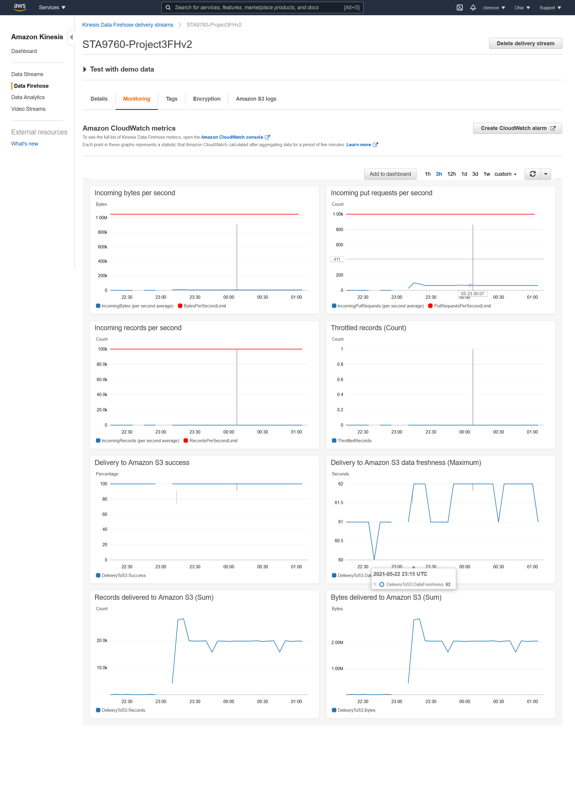
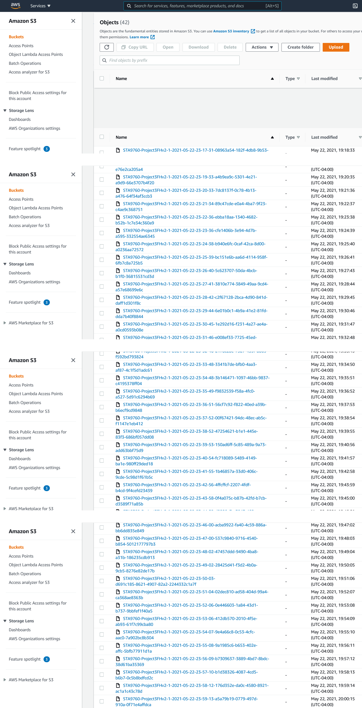

# Colin Brence
# STA 9760, Big Data Technologies
# Project 3: Streaming Finance Data with AWS Lambda

For this project, we use the yfinance Python module, used with an Amazon WebServices (AWS) Kinesis stream, AWS Glue Crawler, AWS Lambda function, and a small SQL query in AWS Athena, in order to grab the highest hourly price information of the following few stocks:

1. Facebook (FB)
2. Shopify (SHOP)
3. Beyond Meat (BYND)
4. Netflix (NFLX)
5. Pinterest (PINS)
6. Square (SQ)
7. The Trade Desk (TTD)
8. Okta (OKTA)
9. Snap (SNAP)
10. Datadog (DDOG)

This information will collect a full trading day (from (9:00 A.M. to 3:00 P.M.) of information, collected in intervals of one minute each. We will collect data from May 11, 2021, in particular.

Our AWS lambda function, the data_transformer.py file, will collect and convert the data price into a JSON document, which in turn is streamed into an S3 bucket. 

Next, we use an AWS Glue crawler to create a table and schema so that we may run an AWS Athena query with our data. Then, we generate a .csv file of the results that contains the data we want.

Finally, we use a Jupyter notebook to analyze and visualize this data from the results.csv.

Note that in our results, we multiple entries for each hourly high price, as the hourly high price may have been reached multiple times within a single hour.

## Kinesis Configuration

## S3 Bucket screenshot

